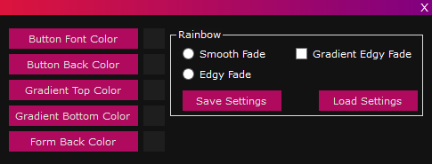

# Information
This is mainly a Java compiler for lazy people like me.

Suggestions are welcome.

<b>Written in:</b>
- C#

## Screenshots
<b>Main Form</b>

 

<b>Settings Form</b>

<b>Tutorial Form</b>

 

<b>Installer Form</b>

 

## To be added
- [ ] Supports python script execution
- [x] Javadoc generation
- [ ] Settings (e.g: Button Color, Button Font, Form BG Color, Gradient Color)
- [x] Compiling multiple files at once
- [x] Tutorial links
- [x] Link installers for Java SE Development Kit
- [x] Rainbow Thingy
- [ ] Tool tips for more information

## Help

- Where is the .exe file?
> Go to `bin/Debug` folder
- How to compile .java file?
> Select file to compile

> Press `add` to add in compiler

> Press `compile` to compile the .java file

## Credits
 - Me :)
