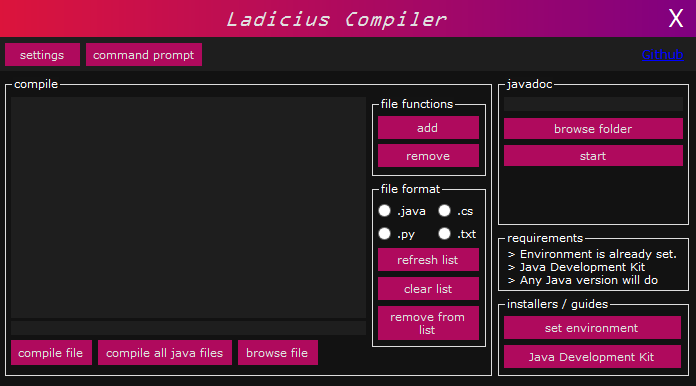
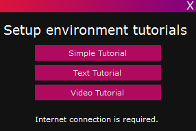
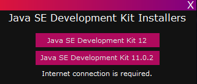

# Information
This is mainly a Java compiler for lazy people like me.

Written in:
- C#

Coded by:
- Sean Baang

## Screenshots
<b>Main Form</b>

 

<b>Tutorial Form</b>

 

<b>Installer Form</b>

 

## Possible updates / To be added
- [ ] Supports python execution
- [ ] Supports csharp compilation
- [ ] Javadoc generation
- [ ] Settings
- [x] Tutorials
- [x] Installers for Java SE Development Kit
- [x] Rainbow Thingy

## Help

1. Where is the .exe file?
> Go to `bin/Debug` folder
2. How to compile .java file?
> Select file to compile

> Press `add` to add in compiler

> Press `compile` to compile the .java file
